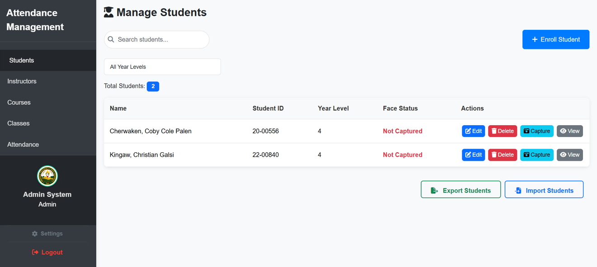
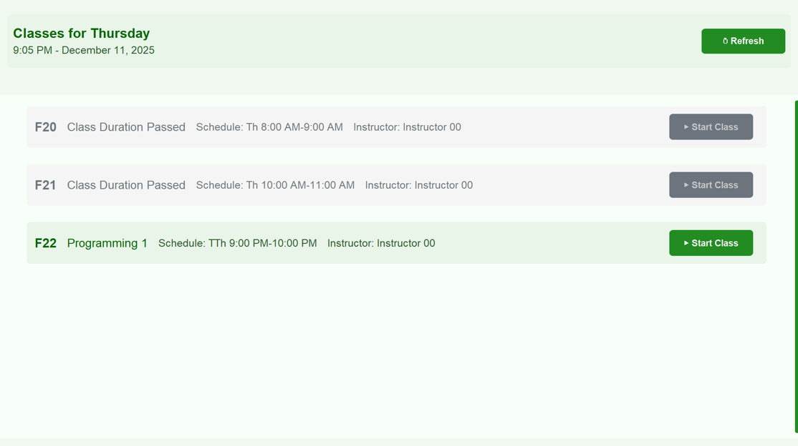
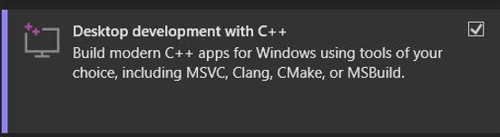
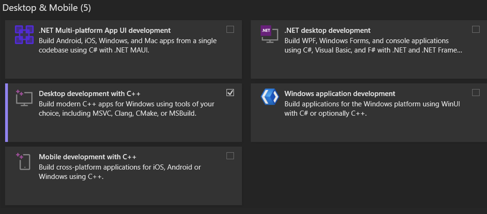

<h1 align="center">MPSU-Facial-Recognition-Attendance-System</h1>

A Flask-based server for a facial recognition attendance system, managing user authentication, facial embeddings, attendance tracking, and API services.

  

## User Manual

### System requirements 
- Visual Studio Community (2022-2026) - some packages need to be compiled with Microsoft’s C/C++ toolchain on Windows — the installer/workload provides that toolchain. 
- CMake - a tool that creates build files for C and C++ projects. Some Python packages use C or C++ code for speed or features. If there is no ready-made wheel on Windows, pip must build the package from source. This build step needs CMake and the Microsoft C++ tools.
- Python 3.11.0 – Programming language used to create and run the system.
- PostgreSQL 13.21 -  Database
- Flask - lightweight WSGI web application framework
  
# System Features

## Administrator Interface

 
The administrator interface is a web-based dashboard for managing the MPSU Attendance Management System. It provides administrators with comprehensive tools to oversee students, instructors, courses, classes, and attendance tracking.

#### Manage Student
 
The Manage Students section lets the administrator handle student records from start to finish. They can add new students with basic details, view all student records with search options, update student information when needed and delete students as long as they are not enrolled in a class.

#### Enrolling a student
 
The Enroll Student function lets an administrator add a new student to the system. The administrator fills out a form with the student’s first name, middle name, last name, student ID and year level. Additionally, the student ID should be entered manually in the correct format. Once submitted, the system creates the student record and shows a success notification. After enrollment, admins can set up facial recognition for the student by capturing photos with the webcam. Once the photos are added, the administrator must go to the settings and extract the facial embeddings.

#### Editing student details 
 The Edit Student function lets admins update a student’s information. An administrator selects a student from the list and open the edit form, which shows the current details. They can change the first name, middle name, last name and year level. The student ID cannot be changed. After making changes, clicking Update Student saves the information to the database. The system validates the input and shows a success notification when the update is complete. If there are errors, messages appear so the administrator can correct them. This ensures student records stay accurate and consistent across the system.

#### Deleting a student 
 
The Delete Student function allows the administrator to remove a student from the system. The administrator selects the student from the list and click the delete button, then confirm the action in a popup. The system first checks if the student is enrolled in any classes. If they are, deletion is blocked and an error message appears. If allowed, the student’s record is removed from the database, along with their face images, face recognition data, attendance records, and enrollment links. A success notification appears, and the student list updates immediately. Deletion is permanent and cannot be undone.

#### Capturing Students Face 
 
The Capturing Face function lets the administrator set up students for facial recognition attendance. The administrator selects a student and opens the camera modal, which shows a live camera feed. They position the student’s face in view with good lighting and take multiple photos from different angles and expressions. After capturing 3-5 photos, the administrator clicks Upload All. The system saves the images securely, prepares the face data for recognition, and updates the student’s face status to “Captured".

#### View Photos 
 
The View Photos function enables the administrator to see all facial recognition photos for a student. The administrator selects a student and opens the photo viewer modal, which shows all uploaded photos in a grid and the option to delete a photo if needed.

#### Manage Instructor
 
The Instructor Management page lets the administrator manage all instructor accounts. The administrator can see a list of instructors with their name, number of assigned classes, department and face status. They can search, add instructors and edit instructor details, delete instructor accounts, capture facial recognition photos, or view and delete existing photos and selecting a department.

#### Adding Instructor 
 
The Add Instructor function lets an administrator create new instructor accounts. The administrator will open the form, enter a unique username, select department, first name, middle name and last name, and a secure password. After submitting, the system validates the information and creates the account. The new instructor can log in immediately and access their dashboard. The administrator can then set up facial capture on the instructors. Passwords are stored securely, and the instructor account is ready for attendance management and class duties. The Edit, Capture, and View Photos functions for instructors work the same way as they do for students. Additionally, an administrator can edit instructor details, capture facial recognition photos using the camera, and view all uploaded photos in a modal. These functions ensure accurate instructor information and prepare their facial data for attendance tracking.

#### Manage Courses
 
The Courses Page lets the administrator manage all courses in the system. An administrator can view a list of courses with their codes and descriptions, search and filter courses, and see the total number of courses. They can add new courses, edit existing ones, or delete courses, with checks to prevent deleting courses linked to classes. Bulk operations like importing and exporting courses via CSV or XSLS are also supported. This page ensures the academic catalog is organized and allows instructors to assign courses to classes properly.

#### Manage Classes
 
The Classes Management page lets administrators create, view, edit, and delete classes in the system. Admins can assign instructors to a class and set class schedules. They can also register and unregister students to an instructor’s class and search classes. The page allows adding new classes, edit and delete existing ones. Bulk operations like importing and exporting class data are also available. This page helps keep schedules organized, instructors assigned correctly, and student enrollment accurate.

#### Adding classes
 
The Add Class function lets the administrator create a new class in the system. An administrator selects a course, enter a unique class code, and assign a primary instructor. They can also assign a substitute instructor if needed. Next, they build the class schedule by selecting days and setting start and end times. Multiple time slots can be added. After reviewing the information, clicking Save Class creates the class in the database. The new class then appears in the class list and is ready for student enrollment. The system checks for required fields, unique class codes, and instructor schedule conflicts to ensure data integrity.

#### Registering student to a class
 
The Register Students function lets an administrator enroll students in classes. The administrator can register or unregister multiple students at once using checkboxes. The interface shows student details like name, ID, year level, and status. Search and filter options help identify students who are/aren’t registered in the class and to find students quickly. After enrollment, the system updates the database, tracks who performed the action, and shows success messages. This ensures accurate class enrollment and prepares students for attendance tracking.

#### Class Attendance
 
The Class Attendance function lets administrators monitor and manage instructor attendance for all classes. The administrator  select a class from a dropdown and see a table with attendance dates, status (Present or Absent), and instructor time in and out but also mark instructors who did not end their class as not logged out. They can view historical records, check real-time attendance, and switch between classes. The system also allows exporting attendance reports as PDFs. This feature tracks instructor compliance, class coverage, and schedule adherence while keeping data secure and restricted to the administrator. It integrates with class and instructor management and uses the database to store and retrieve attendance records.

#### Settings
 
The Settings Page enables an administrator to manage personal and system settings. Only the administrator can change and update their own profile information, change passwords, and upload a profile picture. Admins have additional controls, which are adding room numbers, as well as resetting attendance and classes but also changing the semester and school year if they had reset both attendance and classes. The page also allows managing face recognition data by extracting embeddings. Settings use modals for confirmations, real-time validation, and progress updates. An administrator can export archives before resetting data. The page ensures secure updates, role-based access, and smooth system configuration while keeping user experience simple and interactive.

  

---

## Instructor Interface

 
The Instructor Interface enables instructors to manage attendance, classes and student information. In Attendance, instructors can select a class and view students time in and time out but also their status which are present, absent and late along with the ability to export the attendance of the selected class. In Classes, they can view their assigned schedules and register/unregister a student in their assigned class. In Students, instructors can see the overall list of students that have been registered in their classes and they can also capture a student’s face if they aren’t registered yet and they can view if the captured photos of the students and delete a photo if necessary.

#### Attendance Page
 
The Instructor Attendance Page lets instructors monitor the attendance for their assigned classes. The header shows the current semester, school year, instructor name and date. Instructors select a class from a dropdown to see the course name, schedule and their name. The attendance table lists all enrolled students with status for each class date. Status options are P (Present) in green, L (Late) in yellow and A (Absent) in red. Each cell also shows time in and out. The table only shows dates where class sessions occurred and updates automatically every 5 seconds. Pagination allows viewing six dates per page. Instructors can export the table to PDF in landscape format. The page uses APIs to fetch class details, student lists and attendance records. Students without records are marked absent. Navigation buttons let instructors move between date ranges. This page gives full visibility into attendance patterns and helps track student participation.

#### Classes page
 
The Instructor Classes Page lets instructors see all their assigned classes and register/unregister a student in their classes. Instructors can also search classes by code, course name, or schedule. Additionally, the classes table shows class code, course description, schedule, and a "View" button, which opens the class detail page.
  On this page, instructors can search and filter students by name, ID, year level, or registration status. Each student row shows name, ID, year level, and enrollment status. Checkboxes allow selecting students for bulk enrollment or unenrollment, with a confirmation modal before any action. The page uses APIs to fetch class lists, student details, and handle enrollments. Instructors cannot create, edit, or delete classes. The page updates in real time, prevents duplicate enrollments, and shows success or error messages. 

#### Students page
 
The Students Page lets instructors manage facial recognition photos for students in their classes. A class dropdown lets instructors choose a class or view all students from all assigned classes. A search box updates results in real time, and filters let them sort by year level. The students table shows each student’s name, ID, year level, face status, and two action buttons. The Capture button opens a camera window where instructors can take clear photos from different angles, see thumbnails, delete unwanted shots, and upload all photos at once. The View button opens a gallery that shows all saved photos for that student and allows deleting them. The page updates right away after uploads or deletions and refreshes the face status. Instructors can only manage students in their assigned classes. Photos are stored in the system and tracked in the database. The page handles errors like camera issues or failed uploads.

#### Facial Recognition/Client Interface
 
The class display in the client interface shows all classes scheduled for the day in a clear card layout. The header shows the day and the current time and also has a refresh button. The main area scrolls smoothly and uses an MPSU green theme. It shows class cards or an empty message when no classes are scheduled. Each card shows the class code status schedule instructor and session time on the left. The right side has a button that changes based on the class state.

#### Authentication
 
After an instructor selects a class the Facial Recognition System starts an authentication step to confirm identity and protect active sessions. The system opens the camera and begins face detection using OpenCV. Once a face is found the system extracts a facial embedding using the DeepFace Facenet512 model and compares it with stored instructor embeddings. 

#### Confirmation
 
A match is confirmed when the distance score is below the required threshold.If the instructor is verified the system checks if the class is really assigned to that instructor and if the session is allowed to start. After verification the system loads the room selection screen then creates a new session for the class. If the instructor fails authentication the system shows an error and does not continue. This process keeps every class session secure and makes sure only the right instructor can start or view it. Also it sends a record to the backend and the system marks the instructor as present or absent

#### Room Verification
 
The room verification makes sure only one class session uses a room at a time. When an instructor starts a session a room verification modal appears and shows the class code and a list of rooms. The system checks all active sessions for the day and marks any room that is currently in use. Available rooms appear normally while occupied rooms show an occupied label. If a room is taken the system shows the class and instructor using it. The instructor can choose an available room or override the warning if needed. After selecting a room the system creates a new session assigns the room and starts the scanner. The system keeps checking active sessions every few seconds so all devices stay updated on room occupancy. This process prevents room conflicts supports overrides when needed and keeps session data secure and accurate.

  

---

## Facial Recognition/Scanner

 
The facial recognition scanner is a full-screen application built with CustomTkinter and is used on client devices to take attendance. It runs with three main parts which handle the camera the face recognition and the interface. The scanner uses OpenCV to capture video and detect faces then DeepFace Facenet512 to create face embeddings and match them with cached student or instructor data. When a student is recognized with enough confidence the scanner sends a record to the backend and the system marks the student as present, late, or absent based on the class start time.

#### Instructor Console
 
The Instructor Console is a full-screen interface that instructor’s access through facial recognition after the scanner identifies them. Once the system verifies the instructor, a short countdown appears and the console opens with a welcome message. The console gives three main functions which are registering students, returning to the scanner, and ending the class.

#### Register Students
 
The instructor can view the name, id, year level and face status but also, they have two buttons which are capture photo and view photo. Capture face is used to register students who didn’t have their face status captured yet and when opened it will display a page (see the image below) that has start restart and close button clicking the start button initiates the capturing process and instructors can click stop after taking sufficient photos and they can restart the process but if not, then an instructor will end the process by clicking close.	   
After that the images are saved, processed, and used to create face encodings for recognition. An instructor can also view the photos and they can delete photos if its necessary.

#### Ending a class
  
Ending a class in FRCAS is done through the instructor console. The instructor opens the console from the client during an active session and unlocks it using facial recognition. After entering, the instructor uses the End Class button to finish the session. The system then checks all enrolled students, marks those who scanned as present, and marks the rest as absent. It also records the instructor’s checkout time and closes the session so no more scans can be made.

  When the class is successfully ended, the scanner closes and the system returns to the class selection page. Reports in the web portal update right away, showing the class has ended. If the class was already ended or the instructor does not have permission, the system shows an error. This process keeps attendance accurate, prevents duplicate records, and makes sure each class is closed safely and on time.

---
## Software Installation Procedure

### Installing the server
1. Install the Visual Studio workload (full GUI): open Visual Studio Installer → Modify your installation → check “Desktop development with C++”  →

 
 
→ Now make sure the following was checked → Install.

   

2. Download CMake from its official website at https://cmake.org/download/ and run the installer. Choose the option that adds CMake to your system PATH. When everything is installed open Command Prompt and type cmake --version to check CMake and cl to check the C++ compiler. If both work your system is ready to build packages that need CMake and C++ tools.
3. Installing Python 3.11.0. Go to python.org/downloads/release/python-3110. Pick the file for your computer type. Download the exe file. Run it. Check "Add python.exe to PATH". Click Install Now. Open Command Prompt. Type python --version to check.
4. To install the system, first extract the ZIP folder. After that, open a terminal and create a virtual environment using python -m venv venv. Once the virtual environment is created, activate it and install all required packages like the flask using the code pip install -r requirements.txt. When the installation is complete, you can start the system by running the start_server.bat file.

### Installing the Client or the facial recognition 
For the facial recognition system, start by extracting the ZIP folder. Next, open a terminal and create a virtual environment using python -m venv venv. After the virtual environment is created, activate it and install all required packages with pip install -r requirements.txt. Once everything is installed, you can launch the system by running the start_client.bat file.

### Installing the Database
1. PostgreSQL 13.21 is installed by first downloading the official installer for Windows from the PostgreSQL website. After opening the installer click Next and keep the default installation folder. Select the PostgreSQL Server pgAdmin 4 and Command Line Tools then continue using the default data directory. Set a password for the postgres user and keep the default port 5432. Choose the default locale and proceed with the installation. Once finished open pgAdmin 4 and connect to PostgreSQL 13 using the password you created to confirm that the installation was successful.
2. Since the environment variables are already set up you only need to create the database. Open a terminal and run the command below as the postgres user. This will create the database and assign ownership to the existing user:
psql -U postgres -c "CREATE DATABASE capstone_db OWNER frcas_user;"

3. Before running the migration you need to activate the virtual environment. Open a terminal in your project folder and activate the venv then run the migration command to apply the database changes:
flask db upgrade

4. All set up. The virtual environment is active the database is created and migrations have been applied. The application is now ready to run and connect to PostgreSQL without issues.

### UPDATE:
-for migration steps:
On the first migration attempt we (after your venv activation) set the Flask app target and ran the upgrade:

<strong>$env:FLASK_APP="backend.app"
flask db upgrade -d backend/migrations</strong>

That run hit the term_enum duplicate-type error. After updating the migration file to guard enum creation we reran:
<strong>flask db upgrade -d backend/migrations
flask db current -d backend/migrations</strong>

Those were the only commands involved in the initial migration sequence.

